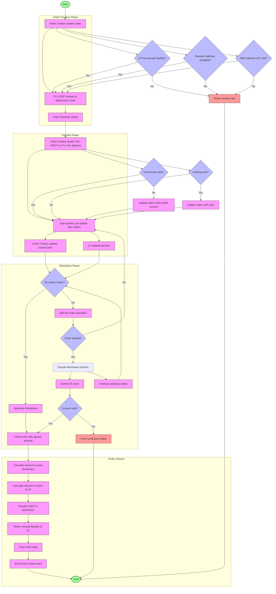

# untron-v2
Efficiency-centric alternative to Untron V1, a P2P swapper from Tron

```mermaid
flowchart TD
    Start([Start]) --> CreateOrder[Order Creator creates order]
    
    subgraph "Order Creation Phase"
        CreateOrder --> LockFunds[LP's USDT locked on deployment chain]
        LockFunds --> OrderActive[Order becomes active]
    end
    
    subgraph "Transfer Phase"
        OrderActive --> SendTronUSDT[Order Creator sends Tron USDT to LP's Tron address]
        SendTronUSDT --> UpdateClaims[Both parties can update their claims]
        
        UpdateClaims --> CreatorUpdatesClaim[Order Creator updates creatorClaim]
        UpdateClaims --> LPUpdatesClaim[LP updates lpClaim]
    end
    
    subgraph "Resolution Phase"
        CreatorUpdatesClaim --> CheckClaimsMatch{Do claims match?}
        LPUpdatesClaim --> CheckClaimsMatch
        
        CheckClaimsMatch -->|Yes| OptimisticResolution[Optimistic Resolution]
        CheckClaimsMatch -->|No| WaitForExpiration[Wait for order expiration]
        
        OptimisticResolution --> CloseOrder[Close order with agreed amount]
        
        WaitForExpiration --> OrderExpired{Order expired?}
        OrderExpired -->|No| UpdateClaims
        OrderExpired -->|Yes| DisputeResolution[Dispute Resolution Options]
        
        DisputeResolution --> ZKProof[Submit ZK proof]
        DisputeResolution --> ContinueNegotiating[Continue updating claims]
        
        ZKProof --> VerifyProof{Is proof valid?}
        VerifyProof -->|Yes| CloseOrder
        VerifyProof -->|No| ProofFailed[Proof verification failed]
        
        ContinueNegotiating --> CheckClaimsMatch
    end
    
    subgraph "Order Closure"
        CloseOrder --> CalculateSurrenderAmount[Calculate amount to send beneficiary]
        CalculateSurrenderAmount --> CalculateReimbursement[Calculate amount to return to LP]
        CalculateReimbursement --> TransferToBeneficiary[Transfer USDT to beneficiary]
        TransferToBeneficiary --> ReturnUnusedLiquidity[Return unused liquidity to LP]
        ReturnUnusedLiquidity --> ClearOrder[Clear order data]
        ClearOrder --> EmitEvent[Emit OrderClosed event]
        EmitEvent --> End([End])
    end
    
    ProofFailed --> End
    
    %% Edge Cases
    CreateOrder --> InsufficientLiquidity{LP has enough liquidity?}
    InsufficientLiquidity -->|No| FailCreation[Order creation fails]
    InsufficientLiquidity -->|Yes| LockFunds
    
    CreateOrder --> ReceiverBusy{Receiver address available?}
    ReceiverBusy -->|No| FailCreation
    ReceiverBusy -->|Yes| LockFunds
    
    CreateOrder --> RateMismatch{Rate matches LP's rate?}
    RateMismatch -->|No| FailCreation
    RateMismatch -->|Yes| LockFunds
    
    SendTronUSDT --> PartialSend{Full amount sent?}
    PartialSend -->|Yes| UpdateClaims
    PartialSend -->|No| UpdateWithPartialAmount[Update claims with partial amount]
    UpdateWithPartialAmount --> UpdateClaims
    
    SendTronUSDT --> NoSend{Nothing sent?}
    NoSend -->|Yes| UpdateWithZero[Update claims with zero]
    NoSend -->|No| UpdateClaims
    UpdateWithZero --> UpdateClaims
    
    FailCreation --> End
    
    %% Styling
    classDef process fill:#f9f,stroke:#333,stroke-width:1px;
    classDef decision fill:#bbf,stroke:#333,stroke-width:1px;
    classDef endpoint fill:#9f9,stroke:#333,stroke-width:1px;
    classDef failpoint fill:#f99,stroke:#333,stroke-width:1px;
    
    class Start,End endpoint;
    class CheckClaimsMatch,OrderExpired,VerifyProof,InsufficientLiquidity,ReceiverBusy,RateMismatch,PartialSend,NoSend decision;
    class CreateOrder,LockFunds,OrderActive,SendTronUSDT,UpdateClaims,OptimisticResolution,CloseOrder,ZKProof,CalculateSurrenderAmount,CalculateReimbursement,TransferToBeneficiary,ReturnUnusedLiquidity,ClearOrder,EmitEvent,CreatorUpdatesClaim,LPUpdatesClaim,ContinueNegotiating,WaitForExpiration,UpdateWithPartialAmount,UpdateWithZero process;
    class FailCreation,ProofFailed failpoint;
```